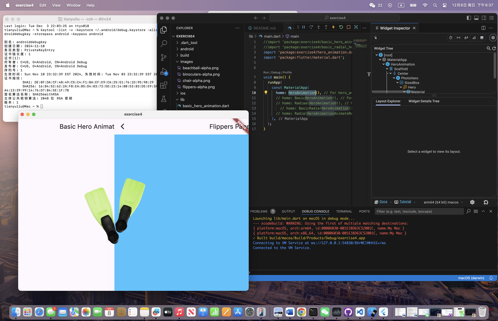

# exercise4

## Output

I have only included the screenshot of HeroAnimation here. The project also includes basic_hero_animation, radial_hero_animation, basic_radial_hero_animation, and radial_hero_animation_animate_rectclip.

